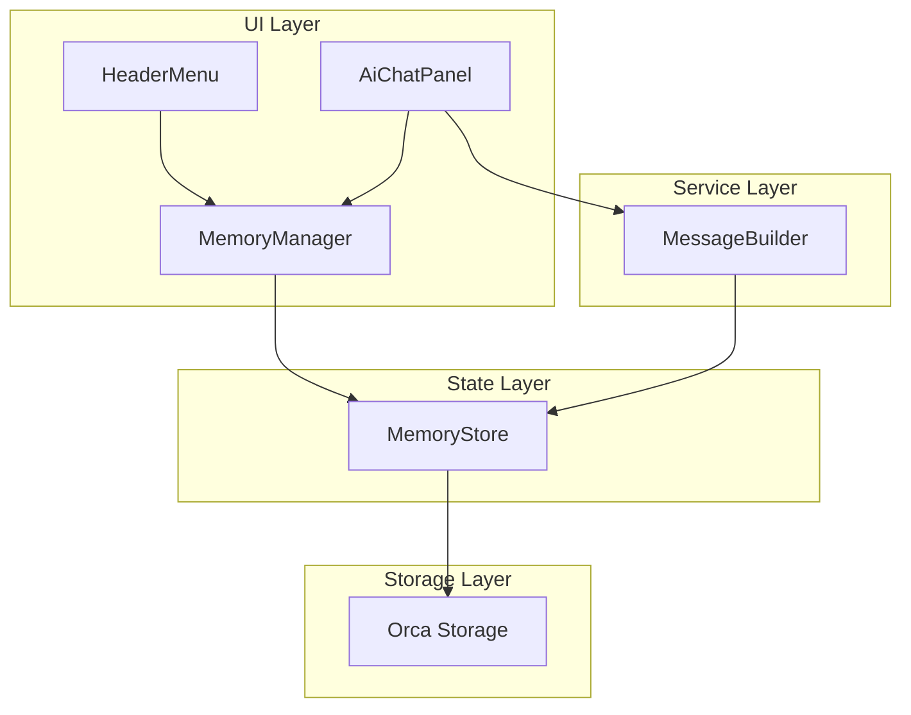

# Design Document: Global Memory Management

## Overview

本设计文档描述全局记忆管理功能的技术实现方案。该功能允许用户存储个人信息和偏好，支持多用户管理和灵活的记忆注入模式，使 AI 能够在对话中记住用户的个性化设定。

### Key Features
- 多用户管理：创建、编辑、删除、切换用户
- 记忆 CRUD：添加、编辑、删除、启用/禁用记忆条目
- 注入模式：ALL（所有用户记忆）vs CURRENT（仅当前用户）
- 搜索过滤：关键词搜索记忆
- 持久化存储：跨会话保存数据

## Architecture



### Component Responsibilities

| Component | Responsibility |
|-----------|----------------|
| MemoryStore | 状态管理、数据持久化、业务逻辑 |
| MemoryManager | 记忆管理 UI 界面 |
| HeaderMenu | 提供"记忆管理"入口 |
| AiChatPanel | 视图切换、消息发送时注入记忆 |
| MessageBuilder | 构建包含记忆的 System Prompt |

### View State Management

AiChatPanel 需要管理视图切换状态：

```typescript
// AiChatPanel 内部状态扩展
type ViewMode = 'chat' | 'memory-manager';

interface AiChatPanelState {
  // ... existing state
  viewMode: ViewMode;
}

// 视图切换逻辑
function handleOpenMemoryManager() {
  setViewMode('memory-manager');
}

function handleCloseMemoryManager() {
  setViewMode('chat');
}

// 渲染逻辑
{viewMode === 'chat' && (
  // 渲染聊天界面
)}
{viewMode === 'memory-manager' && (
  createElement(MemoryManager, { onBack: handleCloseMemoryManager })
)}
```

## Components and Interfaces

### 1. MemoryStore (`src/store/memory-store.ts`)

核心状态管理模块，使用 Valtio 实现响应式状态。

```typescript
// Types
export type InjectionMode = 'ALL' | 'CURRENT';

export interface UserProfile {
  id: string;
  name: string;
  isDefault?: boolean;
  createdAt: number;
}

export interface MemoryItem {
  id: string;
  userId: string;
  content: string;
  isEnabled: boolean;
  createdAt: number;
  updatedAt: number;
}

export interface MemoryStoreData {
  version: number;
  users: UserProfile[];
  memories: MemoryItem[];
  activeUserId: string;
  injectionMode: InjectionMode;
}

// Store Interface
export interface MemoryStoreActions {
  // User Management
  createUser(name: string): UserProfile | null;
  updateUser(id: string, name: string): boolean;
  deleteUser(id: string): boolean;
  setActiveUser(id: string): void;
  
  // Memory Management
  addMemory(content: string): MemoryItem | null;
  updateMemory(id: string, content: string): boolean;
  deleteMemory(id: string): boolean;
  toggleMemory(id: string): boolean;
  
  // Injection Mode
  setInjectionMode(mode: InjectionMode): void;
  
  // Queries
  getActiveUser(): UserProfile | undefined;
  getMemoriesForUser(userId: string): MemoryItem[];
  getEnabledMemories(): MemoryItem[];
  getMemoryText(): string;
  
  // Persistence
  save(): Promise<void>;
  load(): Promise<void>;
}
```

### 2. MemoryManager (`src/views/MemoryManager.tsx`)

记忆管理界面组件。

```typescript
interface MemoryManagerProps {
  onBack: () => void;
}

// Internal State
interface MemoryManagerState {
  searchKeyword: string;
  editingMemoryId: string | null;
  editingUserId: string | null;
  showUserMenu: boolean;
  showDeleteConfirm: string | null; // userId or memoryId
}
```

### 3. HeaderMenu Updates

添加"记忆管理"菜单项。

```typescript
interface HeaderMenuProps {
  onSaveSession: () => void;
  onClearChat: () => void;
  onOpenSettings: () => void;
  onOpenMemoryManager: () => void; // New
}
```

### 4. MessageBuilder Updates

扩展消息构建参数以支持记忆注入。

```typescript
export interface ConversationBuildParams {
  messages: Message[];
  systemPrompt?: string;
  contextText?: string;
  customMemory?: string; // New: 记忆文本
}
```

## Data Models

### Storage Schema

```typescript
// Persisted to Orca storage as JSON
interface PersistedMemoryData {
  version: 1;
  users: UserProfile[];
  memories: MemoryItem[];
  activeUserId: string;
  injectionMode: InjectionMode;
}
```

### Default State

```typescript
const DEFAULT_STATE: MemoryStoreData = {
  version: 1,
  users: [{
    id: 'default-user',
    name: '默认用户',
    isDefault: true,
    createdAt: Date.now()
  }],
  memories: [],
  activeUserId: 'default-user',
  injectionMode: 'ALL'
};
```

### ID Generation

使用时间戳 + 随机字符串确保唯一性：

```typescript
function generateId(): string {
  return `${Date.now()}-${Math.random().toString(36).substr(2, 9)}`;
}
```


## Business Logic

### Input Validation

所有内容输入必须通过验证：

```typescript
function validateContent(content: string): boolean {
  return content.trim().length > 0;
}
```

**验证点：**
- `addMemory`: 拒绝空或纯空格内容
- `updateMemory`: 拒绝空或纯空格内容
- `createUser`: 拒绝空或纯空格名称

### Memory Injection Logic

根据注入模式构建记忆文本：

```typescript
function getMemoryText(state: MemoryStoreData): string {
  const { memories, users, activeUserId, injectionMode } = state;
  
  let enabledMemories: MemoryItem[];
  
  if (injectionMode === 'ALL') {
    // 获取所有用户的启用记忆
    enabledMemories = memories.filter(m => m.isEnabled);
  } else {
    // 仅获取当前用户的启用记忆
    enabledMemories = memories.filter(
      m => m.userId === activeUserId && m.isEnabled
    );
  }
  
  if (enabledMemories.length === 0) return '';
  
  if (injectionMode === 'ALL') {
    // ALL 模式：带用户名前缀
    return enabledMemories.map(m => {
      const user = users.find(u => u.id === m.userId);
      const userName = user?.name || '未知用户';
      return `- [${userName}]: ${m.content}`;
    }).join('\n');
  } else {
    // CURRENT 模式：无前缀
    return enabledMemories.map(m => `- ${m.content}`).join('\n');
  }
}
```

### User Deletion Cascade

删除用户时级联删除其所有记忆：

```typescript
function deleteUser(state: MemoryStoreData, userId: string): boolean {
  // 禁止删除默认用户
  const user = state.users.find(u => u.id === userId);
  if (!user || user.isDefault) return false;
  
  // 删除用户
  state.users = state.users.filter(u => u.id !== userId);
  
  // 级联删除记忆
  state.memories = state.memories.filter(m => m.userId !== userId);
  
  // 如果删除的是当前用户，切换到默认用户
  if (state.activeUserId === userId) {
    state.activeUserId = 'default-user';
  }
  
  return true;
}
```

## UI Design

### Memory Manager Layout

```
┌─────────────────────────────────────────────────────┐
│ ← 返回                              记忆管理        │
├─────────────────────────────────────────────────────┤
│ ┌─────────────────────────────────────────────────┐ │
│ │ 用户: [默认用户 ▼]  [+] [✏️] [🗑️]              │ │
│ │ 注入模式: [ALL ▼]                               │ │
│ │ 统计: 3 条记忆 (2 条启用)                       │ │
│ └─────────────────────────────────────────────────┘ │
├─────────────────────────────────────────────────────┤
│ ┌─────────────────────────────────────────────────┐ │
│ │ 🔍 搜索记忆...              [+ 添加记忆]        │ │
│ └─────────────────────────────────────────────────┘ │
├─────────────────────────────────────────────────────┤
│ ┌─────────────────────────────────────────────────┐ │
│ │ ☑️ 我叫张三                        [✏️] [🗑️]   │ │
│ ├─────────────────────────────────────────────────┤ │
│ │ ☑️ 我是素食主义者，不要推荐含肉食谱 [✏️] [🗑️]   │ │
│ ├─────────────────────────────────────────────────┤ │
│ │ ☐ 我偏好使用 TypeScript            [✏️] [🗑️]   │ │
│ └─────────────────────────────────────────────────┘ │
│                                                     │
│         ─── 或 ───                                  │
│                                                     │
│ ┌─────────────────────────────────────────────────┐ │
│ │     📝                                          │ │
│ │     暂无记忆                                    │ │
│ │     开始添加您的第一条记忆吧                    │ │
│ └─────────────────────────────────────────────────┘ │
└─────────────────────────────────────────────────────┘
```

### Component Hierarchy

```
MemoryManager
├── Header (返回按钮 + 标题)
├── UserControlSection
│   ├── UserSelector (下拉选择用户)
│   ├── UserActions (新建/编辑/删除按钮)
│   ├── InjectionModeSelector (ALL/CURRENT 切换)
│   └── Stats (记忆统计)
├── Toolbar
│   ├── SearchInput
│   └── AddMemoryButton
└── MemoryList
    ├── MemoryItem[] (记忆条目)
    └── EmptyState (空状态提示)
```

### Interaction States

| State | Trigger | UI Change |
|-------|---------|-----------|
| 编辑记忆 | 点击编辑按钮 | 内容变为输入框，显示保存/取消 |
| 删除确认 | 点击删除按钮 | 显示确认对话框 |
| 搜索过滤 | 输入搜索词 | 实时过滤记忆列表 |
| 切换用户 | 选择下拉项 | 刷新记忆列表 |
| 切换模式 | 选择 ALL/CURRENT | 更新模式，立即生效 |

## Persistence Strategy

### Storage Key

```typescript
const STORAGE_KEY = 'ai-chat-memory-store';
```

### Save Logic

每次状态变更后自动保存：

```typescript
async function save(state: MemoryStoreData): Promise<void> {
  const data: PersistedMemoryData = {
    version: state.version,
    users: state.users,
    memories: state.memories,
    activeUserId: state.activeUserId,
    injectionMode: state.injectionMode
  };
  
  await orca.state.set(STORAGE_KEY, JSON.stringify(data));
}
```

### Load Logic

插件初始化时加载：

```typescript
async function load(): Promise<MemoryStoreData> {
  try {
    const raw = await orca.state.get(STORAGE_KEY);
    if (!raw) return DEFAULT_STATE;
    
    const data = JSON.parse(raw) as PersistedMemoryData;
    
    // 验证数据完整性
    if (!data.users || !data.memories) {
      return DEFAULT_STATE;
    }
    
    // 确保默认用户存在
    if (!data.users.find(u => u.id === 'default-user')) {
      data.users.unshift({
        id: 'default-user',
        name: '默认用户',
        isDefault: true,
        createdAt: Date.now()
      });
    }
    
    return {
      ...DEFAULT_STATE,
      ...data,
      injectionMode: data.injectionMode || 'ALL'
    };
  } catch {
    return DEFAULT_STATE;
  }
}
```


## Correctness Properties

*A property is a characteristic or behavior that should hold true across all valid executions of a system-essentially, a formal statement about what the system should do. Properties serve as the bridge between human-readable specifications and machine-verifiable correctness guarantees.*

Based on the acceptance criteria analysis, the following correctness properties must be validated:

### Property 1: User ID Uniqueness
*For any* sequence of user profile creations with arbitrary names, all generated user IDs SHALL be unique (no two users share the same ID).
**Validates: Requirements 1.2**

### Property 2: User Profile Update Consistency
*For any* existing user profile and any valid (non-empty) new name, updating the profile SHALL result in the profile having the new name while preserving the original ID and other properties.
**Validates: Requirements 1.3**

### Property 3: User Deletion Cascade
*For any* non-default user profile with associated memories, deleting the user SHALL remove both the user and all their memories from the store.
**Validates: Requirements 1.5**

### Property 4: Active User Switch Persistence
*For any* valid user ID in the store, switching to that user SHALL update activeUserId to match the target user ID.
**Validates: Requirements 1.6**

### Property 5: Memory Creation Integrity
*For any* valid (non-whitespace) content string, adding a memory SHALL create a MemoryItem with: unique ID, userId matching activeUserId, isEnabled set to true, and valid timestamps.
**Validates: Requirements 2.1, 2.3**

### Property 6: Whitespace Content Rejection
*For any* string composed entirely of whitespace characters (including empty string), attempting to add or edit a memory with that content SHALL be rejected, leaving the store unchanged.
**Validates: Requirements 2.2, 3.2**

### Property 7: Memory Update Timestamp
*For any* existing memory and any valid new content, updating the memory SHALL change the content and set updatedAt to a value greater than or equal to the original updatedAt.
**Validates: Requirements 3.1**

### Property 8: Memory Deletion Completeness
*For any* existing memory ID, deleting that memory SHALL remove it from the memories array (the memory SHALL NOT be findable after deletion).
**Validates: Requirements 3.3**

### Property 9: Memory Toggle Inversion
*For any* existing memory, toggling its enabled state SHALL flip the isEnabled boolean (true becomes false, false becomes true).
**Validates: Requirements 4.1**

### Property 10: Enabled Memory Filtering
*For any* set of memories with mixed enabled states, the injection process SHALL include only memories where isEnabled is true.
**Validates: Requirements 4.2, 4.3**

### Property 11: Search Filter Correctness
*For any* search keyword and set of memories, the filtered result SHALL contain exactly those memories whose content includes the keyword (case-insensitive).
**Validates: Requirements 5.1**

### Property 12: Injection Mode ALL Behavior
*For any* store state with multiple users and memories, when injectionMode is "ALL", getMemoryText() SHALL return a string containing enabled memories from ALL users, each prefixed with `- [用户名]:`.
**Validates: Requirements 6.2, 6.4**

### Property 13: Injection Mode CURRENT Behavior
*For any* store state, when injectionMode is "CURRENT", getMemoryText() SHALL return a string containing only enabled memories from the active user, each prefixed with `- ` (no user name).
**Validates: Requirements 6.3, 6.5**

### Property 14: Injection Mode Persistence
*For any* injection mode change (ALL to CURRENT or vice versa), the new mode SHALL be persisted and retrievable after reload.
**Validates: Requirements 7.3**

### Property 15: Data Round-Trip Consistency
*For any* valid MemoryStoreData state, serializing to JSON and then deserializing SHALL produce an equivalent state object (all users, memories, activeUserId, and injectionMode match).
**Validates: Requirements 11.1, 11.2, 11.3**

## Error Handling

### Validation Errors

| Operation | Error Condition | Handling |
|-----------|-----------------|----------|
| addMemory | Empty/whitespace content | Return null, no state change |
| updateMemory | Empty/whitespace content | Return false, no state change |
| updateMemory | Invalid memory ID | Return false, no state change |
| createUser | Empty/whitespace name | Return null, no state change |
| deleteUser | Default user ID | Return false, no state change |
| deleteUser | Invalid user ID | Return false, no state change |

### Storage Errors

| Operation | Error Condition | Handling |
|-----------|-----------------|----------|
| load | Parse error | Return DEFAULT_STATE |
| load | Missing data | Return DEFAULT_STATE |
| load | Invalid structure | Return DEFAULT_STATE |
| save | Storage API error | Log error, continue (best effort) |

## Testing Strategy

### Testing Framework

使用 Vitest 作为测试框架，fast-check 作为属性测试库。

```json
// package.json devDependencies
{
  "vitest": "^1.0.0",
  "fast-check": "^3.0.0"
}
```

### Unit Tests

单元测试覆盖具体示例和边界情况：

1. **初始化测试**
   - 首次初始化创建默认用户
   - 默认注入模式为 ALL

2. **边界情况测试**
   - 删除默认用户被拒绝
   - 空搜索返回所有记忆
   - 无启用记忆时返回空字符串

### Property-Based Tests

属性测试验证通用正确性：

每个属性测试必须：
- 使用 fast-check 生成随机输入
- 运行至少 100 次迭代
- 使用注释标注对应的正确性属性

```typescript
// Example test annotation format
/**
 * **Feature: global-memory-management, Property 5: Memory Creation Integrity**
 * **Validates: Requirements 2.1, 2.3**
 */
test.prop([fc.string().filter(s => s.trim().length > 0)])(
  'adding valid content creates memory with correct properties',
  (content) => {
    // Test implementation
  }
);
```

### Test File Structure

```
tests/
├── memory-store.test.ts        # Store unit tests
├── memory-store.property.ts    # Store property tests
└── memory-injection.test.ts    # Injection logic tests
```

## File Changes Summary

| File | Change Type | Description |
|------|-------------|-------------|
| `src/store/memory-store.ts` | New | 核心状态管理模块 |
| `src/views/MemoryManager.tsx` | New | 记忆管理 UI 组件 |
| `src/views/HeaderMenu.tsx` | Modify | 添加"记忆管理"菜单项 |
| `src/views/AiChatPanel.tsx` | Modify | 集成 MemoryManager，注入记忆 |
| `src/services/message-builder.ts` | Modify | 支持 customMemory 参数 |
| `tests/memory-store.test.ts` | New | 单元测试 |
| `tests/memory-store.property.ts` | New | 属性测试 |
